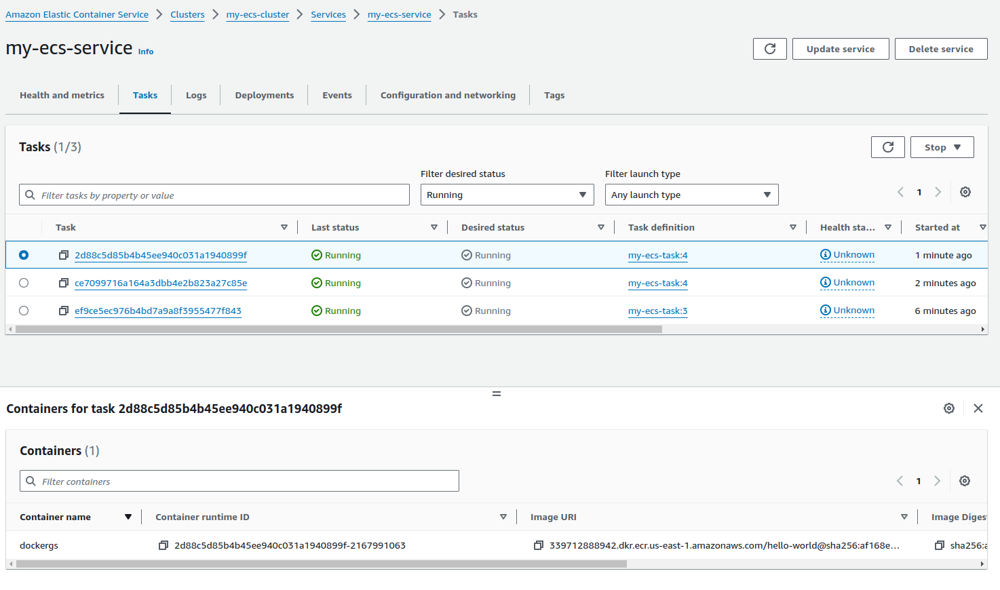
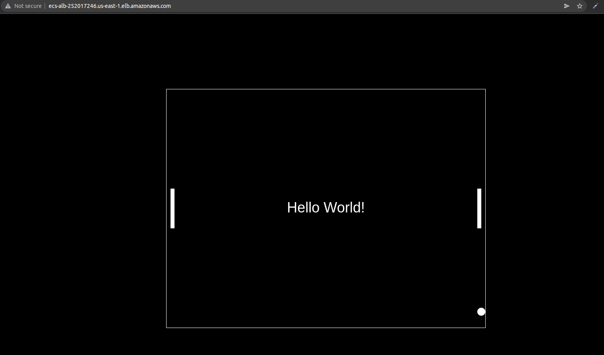
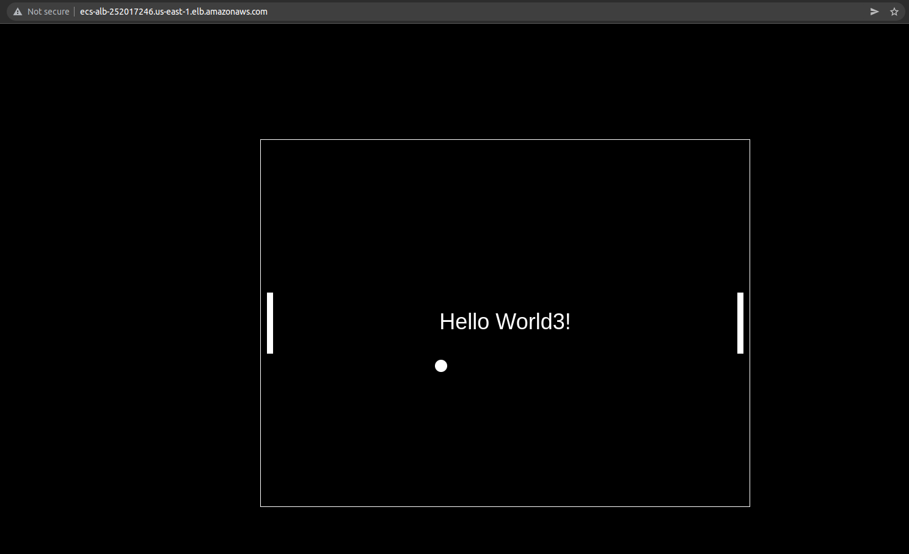

# App-Nimbux

En este respositorio se encuentra la app a ejecutar dentro del contenedor.
Es una app hecha en python que muestra un Hello-World y un detallito extra :D

## Archivos a tener en cuenta

- **cicd.yml**: aca se encuentra la configuracion del pipeline de Github Actions.
- **Dockerfile**: aca se encuentra la configuracion de la imagen a pushear a ECR.
- **run.py**: app de python.
- **templates**/**requirements.txt**: cosas que se usaron para correr la app.

###
### cicd.yml
Es una automatizacion del push de la imagen a ECR y actualizacion del task definition de los contenedores de ECS para actualizar el codigo con la app funcionando.

### Visualizacion grafica de los cambios

### En caso de test

El respositorio esta automatizado de modo que si se hace un push a *main*, este ejecutara el pipeline con los pasos correspondientes a deployar el codigo.

**IMPORTANTE** se deben configurar previamente los secrets.
- AWS_ACCESS_KEY_ID
- AWS_SECRET_ACCESS_KEY
- AWS_REGION (no modificar, es default, *us-east-1*)
- ECR_REGISTRY (*account-id.dkr.ecr.us-east-1.amazonaws.com/hello-world*)
- ECS_CLUSTER (no modificar, es default, *my-ecs-cluster*)
- ECS_SERVICE (no modificar, es default, *my-ecs-service*)
- ECS_TASK_FAMILY (no modificar, es default, *my-ecs-task*)

En caso de querer correrlo en **local**:
- clonar el respositorio
- configurar las variables de acceso y region con *aws configure*
- correr *aws ecr get-login-password --region us-east-1 | docker login --username AWS --password-stdin <-repo-ecr->*
- correr *docker build -t hello-world .*
- correr *docker tag hello-world:latest <-repo-ecr->/hello-world:latest*
- correr *docker push <-repo-ecr->/hello-world:latest*